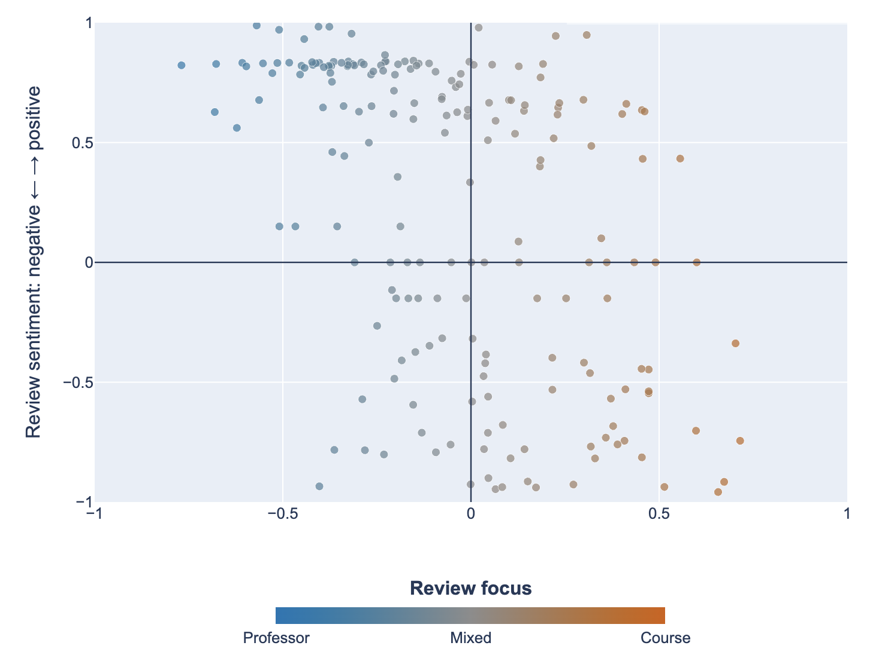
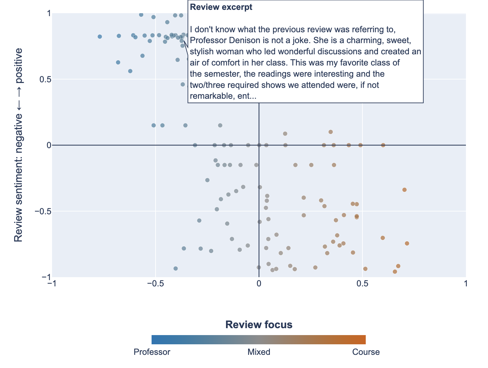

# CULPA Review Classifier

Designed for publication in a Columbia Daily Spectator article under the Data Visualization division. Zero-shot classification of Columbia course reviews along the dimensions students care about: workload, difficulty, grading fairness, lecture quality. Uses natural-language labels with NLI models instead of a trained classifier.

CULPA reviews pair a 1 to 5 rating with free text. The rating says whether someone liked the class. The text says why, and nobody has aggregated that. Zero-shot fits because the useful labels are unknown in advance and there is no labeled training set, while the numeric rating gives a partial ground truth to validate against.

## Output

Each review is placed on a two-axis compass. The x-axis is what the review is about, from professor-focused (blue) to course-focused (orange), scored by zero-shot NLI. The y-axis is sentiment, scored by a RoBERTa sentiment model. Every point is a review, and hovering shows the excerpt.

<p align="center">
  
</p>

<p align="center">
  
</p>

The interactive version is in [notebooks/culpa_review_compass_page.html](notebooks/culpa_review_compass_page.html).

## Running it

```bash
python -m venv .venv && source .venv/bin/activate
pip install -r requirements.txt
jupyter lab notebooks/01_zero_shot_exploration.ipynb
```

First run downloads model weights (about 1.6GB for BART-MNLI).

## Approach

1. Clean the corpus (28,363 reviews with non-empty text)
2. Classify each review against candidate label sets
3. Validate predicted sentiment against the numeric rating
4. Aggregate to per-course and per-instructor profiles

| Model | Notes |
|---|---|
| `facebook/bart-large-mnli` | Standard zero-shot baseline, slow |
| `knowledgator/comprehend_it-base` | Much smaller, competitive on NLI classification |

## Data

`data/review_sample.csv` is a random 200-review sample so the notebook runs out of the box. The full corpus is not committed: reviews name individual instructors, and I have not confirmed CULPA's redistribution terms. The pipeline accepts any CSV with `review` and `rating` columns.

## License

MIT. See [LICENSE](LICENSE).